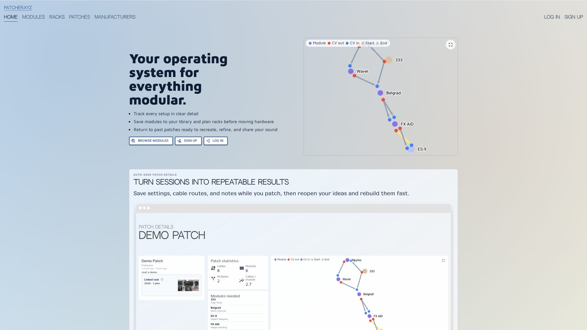

# Patcher Docs

Patcher is the digital twin workspace for Eurorack musicians.

Use it to browse modules, build a collection, plan racks, capture patches, keep notes close, and share work on your terms.

_The Patcher home page — public browsing on one side, signed-in workspace on the other._

## Start here

Patcher rewards a simple ladder:

1. Browse the public [Modules](learn-patcher.xyz/modules.md) database.
2. Add the modules you own to your [Collection](learn-patcher.xyz/collection.md).
3. Build [Racks](learn-patcher.xyz/racks.md) from that collection.
4. Capture [Patches](learn-patcher.xyz/patches.md) so routing, notes, and recall live together.
5. Share selected work — or keep it private — through [Public Profiles](learn-patcher.xyz/public-profiles.md) and per-item toggles.

For a walk-through of a first useful session, see [Quick start](what-is-this/quick-start.md).

## What Patcher is good at

- **Building a module library** that stays useful once planning starts.
- **Turning your collection into working racks** before you move hardware around.
- **Capturing patches while they are still fresh**, with modules, routing, and notes in one place.
- **Keeping public browsing open** so modules, racks, and patches stay easy to explore.
- **Letting you share selectively** through public racks, public patches, and public profiles.

## Public Open API

Patcher also ships a key-required Public Open API, live at `api.patcher.xyz`, for reading catalogue data — modules, manufacturers, standards, and tags. There is no anonymous access, and it does not yet cover public patches, public racks, panel images, or pricing. See [Public Open API](learn/public-open-api.md) for endpoints and examples.

## Guided reading

- [What is Patcher?](what-is-this/readme.md)
- [Quick start](what-is-this/quick-start.md)
- [Core Workflows](learn-patcher.xyz/readme.md)
- [User Area](learn-patcher.xyz/user-area.md)
- [Public Profiles](learn-patcher.xyz/public-profiles.md)
- [Account and Privacy](learn-patcher.xyz/account-and-privacy.md)
- [Modular Glossary](learn/modular-glossary.md)

## Project and support

- [Project Overview](the-project/overview.md)
- [FAQ](the-project/readme.md)
- [Contact / Help / Community](the-project/contact-us-help-community.md)
- [Support and Status](the-project/support-and-status.md)

## Useful links

- [Open Patcher](https://patcher.xyz/)
- [Discord community](https://discord.gg/JNy2HTb5ru)
- [GitHub project](https://github.com/Polyterative/Patcher)
- [Status page](https://patcher.statuspage.io/)
- [Public Open API](learn/public-open-api.md)

---

_Patcher v6.5.2 — for what is shipping and what is next, see [Development status](the-project/development-status.md)._
