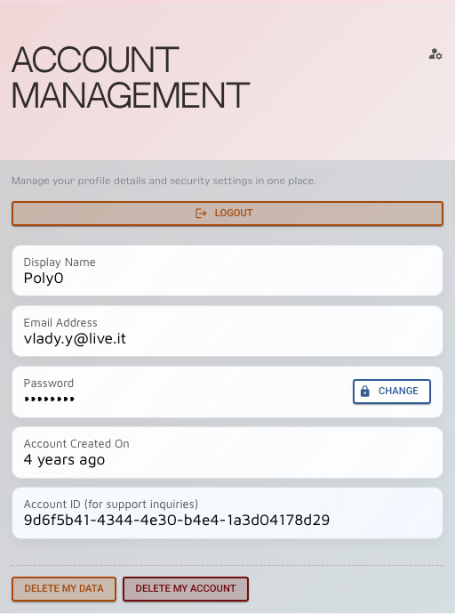

# Account and Privacy

This page covers the basic account choices that shape how public or private your Patcher use feels.

## Browsing without signing in

You can explore the public side of Patcher without an account.

That includes public module browsing and other public-facing surfaces.

## What signing in unlocks

Once you have an account, you can:

- save modules to your collection
- build racks
- create patches
- use the full user area
- manage your public profile settings

## Public vs private

A good default is to start private.

Use Patcher as your own working space first, then make specific surfaces public when they are ready.

## Public profile visibility

Your public profile can be switched on or off from your signed-in workspace.

When the profile is private, the public profile page is not available to other people.

## Username and profile basics

Your username is part of the public profile identity. If you add a website, that can also appear on the public profile
page.

## Sharing carefully

Before making your profile public, review:

- which racks should be public
- which patches should be public
- whether your profile link is ready to share

## Support

If you need help with account-related issues, start here:

- [Contact us / Help / Community](../the-project/contact-us-help-community.md)
- [FAQ](../the-project/readme.md)
