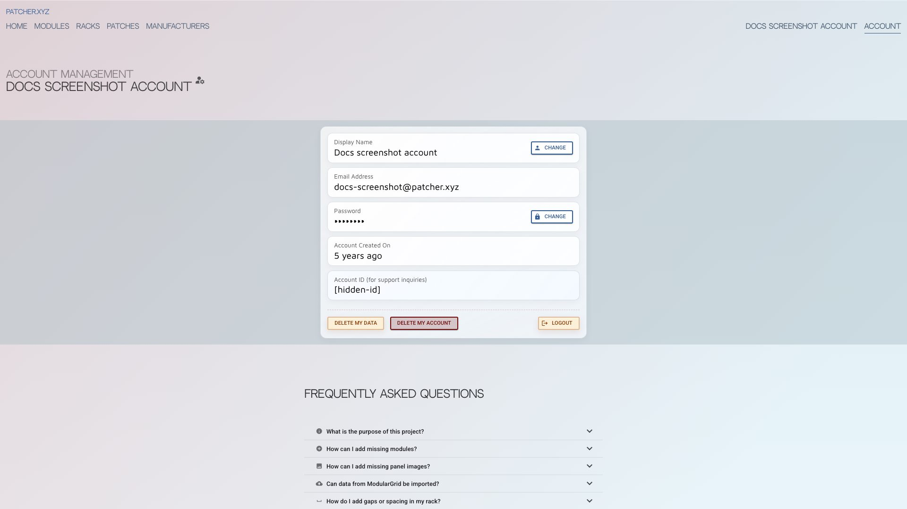

# Account and Privacy

This page covers the account choices that shape how public or private your Patcher workspace feels.

_Account settings — sign-in method, display name, sharing defaults, and data-deletion controls._

## Browsing without signing in

You can explore the public side of Patcher without an account, including modules, public racks, public patches, and public profiles.

## What signing in unlocks

Once you have an account, you can:

- save modules to your collection
- build racks
- create patches
- use the full user area
- manage your public profile settings

## Sign-in

Patcher supports Google sign-in alongside email-and-password accounts.

Sign-in is linked: signing in again with the same Google identity resolves to the same account, so you do not end up with a second parallel account just because you used a different sign-in entry point next time.

A direct password-change control appears only when your account uses email sign-in exclusively. When Google sign-in is linked — either on its own or alongside email — password changes go through the change-account-type flow instead.

## Public vs private items

Profile visibility and item visibility are separate choices.

New racks and patches start Public. You can switch them to **Private** before creation or at any time later.

Private racks and patches are **unlisted**: they are hidden from public browse and public-profile listings, but anyone with the token URL can still open them anonymously. Private is **not a security boundary** — use it to declutter listings, not to protect sensitive material.

For public discovery, both the item and the profile need to be public.

## Profile visibility

Your public profile can be switched on or off from your signed-in workspace. When the profile is private, the public profile page at `/u/:username` is not available to other people.

Profile visibility does not change an item's own visibility. Making a profile Private does not make its existing Public racks or patches Private — that is a separate toggle on each item.

## Display name

Your visible display name can be changed at any time from account controls. The underlying username is what makes your profile addressable at `/u/:username`; the display name is the label people see on the page. See [Public Profiles](public-profiles.md) for how the two interact.

## Delete data vs delete account

Patcher offers two distinct removal flows so you can walk away from your data without losing the account, or leave entirely.

- **Delete data** clears your workspace — modules, racks, patches, notes — while keeping the account itself. Useful when you want a clean slate but plan to sign back in.
- **Delete account** removes the account and its data.

Both flows are intentional and destructive. Read the confirmation prompt carefully before continuing.

## Telemetry

For details on how Patcher handles error monitoring and product analytics, see [Telemetry and privacy](../the-project/telemetry-and-privacy.md).

## Sharing carefully

Before making your profile public, review:

- which racks should be public
- which patches should be public
- whether your profile link is ready to share

## Support

If you need help with account-related issues, start here:

- [Contact us / Help / Community](../the-project/contact-us-help-community.md)
- [Support and status](../the-project/support-and-status.md)
- [FAQ](../the-project/readme.md)
