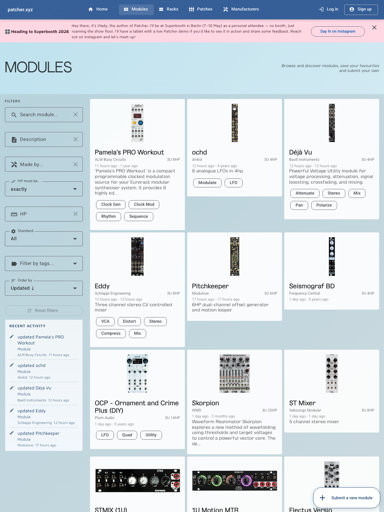

# Modules

The module browser is where most people start.

It is both a public catalogue and the entry point into your own workspace.

## What you can do here

- browse the public module database
- search for modules by name or manufacturer
- inspect module details before adding anything to your own workspace
- add owned modules to your collection
- open manuals quickly when they are available
- discover related public racks and patches
- contribute missing data when something is not in the catalogue yet

## What module detail pages include

Depending on the module, the detail page can include:

- manufacturer
- format and size
- panel images
- power information
- I/O information
- tags and descriptive metadata
- links to manuals
- public racks using the module
- public patches using the module

## Add a module to your collection

1. Create an account or log in.
2. Open **Modules**.
3. Find a module you own.
4. Open the detail page.
5. Use the add action to save it to your collection.

Once a module is in your collection, it becomes available across the rest of the app.

## Why the collection matters

Your collection is not just a wishlist. It powers:

- rack planning
- patch capture
- manual shortcuts in your user area
- a more realistic digital twin of your real system

If you skip this step, your racks and patches will feel less connected to the hardware you actually use.

## Missing module? Add it

If the database does not contain a module yet, use **Submit New Module**.

That helps both the public catalogue and your own workflow, because once the module exists in the library, it becomes
easier to use everywhere else in Patcher.

## Panel images and manuals

Some modules include multiple panel images or variants. That matters when the physical look of the module affects your
planning or rack screenshots.

Manual links become more useful as your collection grows, because Patcher also surfaces those manuals in your user area.

## Best way to use Modules

1. Search for hardware you already own.
2. Add that hardware to your collection.
3. Check manuals and metadata while you are there.
4. Use the collection as the source for racks and patches.

## Related pages

- [Collection](collection.md)
- [User Area](user-area.md)
- [Racks](racks.md)
- [Patches](patches.md)
