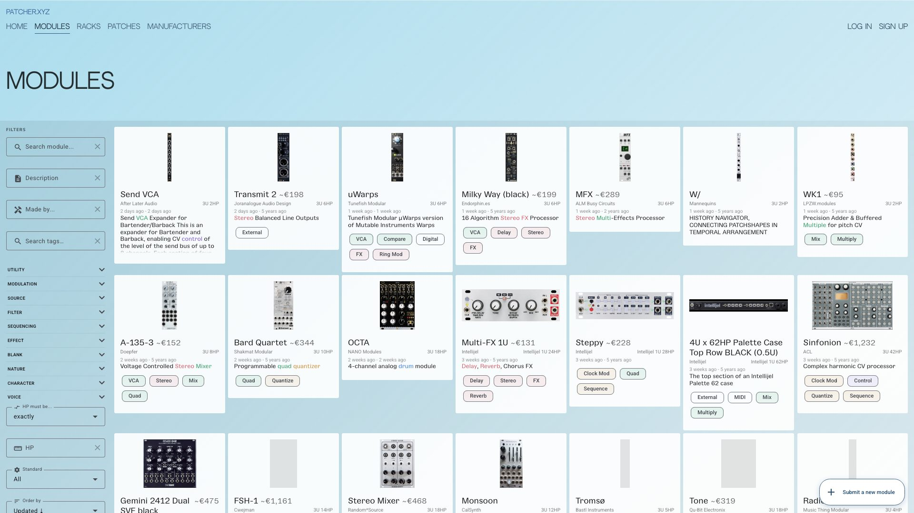

# Modules

The module browser is where most people start.

It is both the public catalogue and the front door to your own workspace.

Browsing is public. Adding modules to your collection or using collection-driven actions requires a signed-in account.

_The Modules page — public, searchable, and the entry point into every module detail page._

## Browse and filter

The module list combines free-text search with structured filters:

- **Tag filters** are grouped and support **Any / All** semantics. **Any** returns modules that match at least one selected tag; **All** returns only modules that match every selected tag.
- **Manufacturer filters** narrow the list to a specific maker or a set of makers.
- Free-text search matches module name, manufacturer, description, and tags at once.
- Results grow with **load-more** as you keep scrolling — there is no infinite scroll.

Filters compose, so combining tags, a manufacturer, and a search term gives you a shortlist rather than a full catalogue dump.

## What module detail pages include

Detail pages are organized into a few consistent sections. Coverage varies by module, so a page only shows what has real data behind it.

### Discovery

The **discovery** area lists public racks and public patches that use the module. Use it to see how other people are actually deploying the module before you commit to it.

### Analysis

The **analysis** area surfaces module-level analytical fields — size, format, power information, category or function tags, I/O counts, and similar structured metadata. This is the "what does this module actually offer" answer.

### Panel

The **panel** area shows the module's panel images. When a module has more than one panel image or variant, you can switch between them so the visual matches the hardware in front of you.

### Community stats

The **community stats** area shows module-level numbers coming from public usage — how many public racks include the module, how many public patches include it, and similar aggregate signals.

### Submit-similar

The **submit-similar** action lives on the detail page itself. Use it when a nearly identical module — usually a revision or a panel variant — is not yet in the catalogue and you want to add it while keeping the existing module as context. See [Contributing module data](contributing-module-data.md).

Manual links appear when a module has enough data and a manual URL has actually been added.

## Add a module to your collection

1. Create an account or log in.
2. Open **Modules**.
3. Find a module you own.
4. Open the detail page.
5. Use the add action to save it to your [Collection](collection.md).

Once a module is in your collection, it becomes available across the rest of the app.

## Why the collection matters

Your collection is not a wishlist. It powers:

- rack planning — see [Racks](racks.md)
- patch capture — see [Patches](patches.md)
- manual shortcuts inside your [User Area](user-area.md) — see [Manuals](manuals.md)
- a more realistic picture of your real system

If you skip this step, your racks and patches will feel more like disconnected drafts than reflections of your real setup.

## Missing module or missing data?

If a module is not in the catalogue at all, use **Submit New Module**.

If a module is in the catalogue but panels, manuals, or metadata are incomplete, improving the record is often the more useful contribution. Module data coverage is still improving; treat missing data as a reason to help, not as proof the feature is unavailable.

See [Contributing module data](contributing-module-data.md) for the full submit and improve flows.

## Panel images and manuals

Some modules include multiple panel images or variants. That matters when the physical look of the module affects your planning or rack screenshots.

Manual links become more useful as your collection grows, because Patcher also surfaces those manuals in [User Area](user-area.md) under **Manuals**.

## Best way to use Modules

1. Search for hardware you already own.
2. Add that hardware to your collection.
3. Check panels, manuals, and metadata while you are there.
4. Use the collection as the source for racks and patches.

## Related pages

- [Collection](collection.md)
- [User Area](user-area.md)
- [Racks](racks.md)
- [Patches](patches.md)
- [Manuals](manuals.md)
- [Contributing module data](contributing-module-data.md)
- [Modular glossary](../learn/modular-glossary.md)
- [Public Open API Preview](../learn/public-open-api.md)
