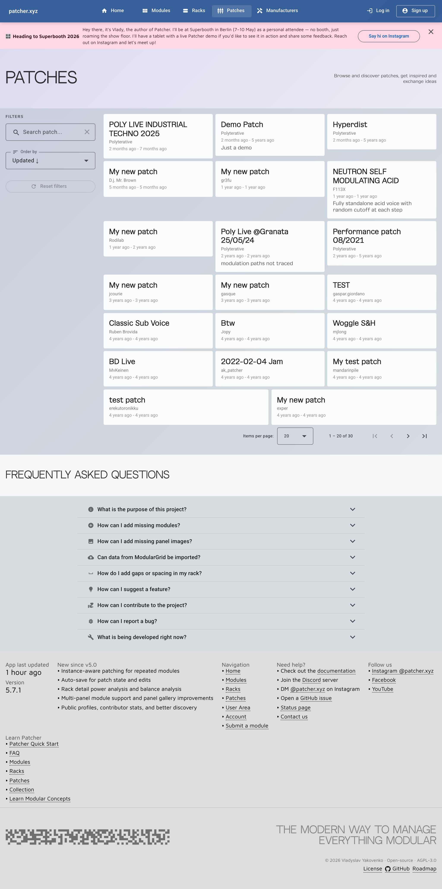

# Patches

Patches are the memory layer of Patcher.

Use them when you want more than a loose note or a photo on your phone. A good patch entry lets you reopen a session
later and still understand what mattered.

## What a patch can hold

A patch can bring together:

- the modules involved
- cable routing
- notes and descriptive text
- naming that makes recall easier later
- sharing choices for public visibility

## Create a patch

1. Go to **User Area**.
2. Open the **Patches** section.
3. Click **Create patch**.
4. Name it clearly.
5. Add the modules you need.
6. Start documenting routing and notes.

## Why collection-first matters here

Patches work best when your collection is already accurate.

That gives you a reliable source list for module assignment and keeps your patch notes grounded in the hardware you
actually use.

Read more: [Collection](collection.md)

## Add modules to a patch

Before you can document routing well, the relevant modules need to be part of the patch.

The practical flow is:

1. keep your collection up to date
2. create the patch
3. add the modules involved
4. document the signal path

## Add connections

Once the patch contains the right modules, add the routing step by step.

This is where Patcher becomes genuinely useful for recall:

- inputs and outputs can be documented intentionally
- repeated modules remain distinct
- the patch stays readable later instead of turning into guesswork

If a module is missing useful I/O data, improve the module data first when possible. That pays off everywhere else too.

## Edit without fear

Patches are meant to evolve while you work.

Patcher is built around faster iteration, including auto-save for patch state and edits, so it works well during active
use instead of only after the session is over.

## Naming and notes

The more patches you save, the more naming matters.

Good patch names and notes should answer:

- what the patch does
- what makes it different
- what you would need to remember under pressure

## Public and private use

Not every patch needs to be shared.

Some people use Patcher as a private recall library first and turn public sharing on only for selected work later.

That is a good default.

## Best practices

- save patches while the session is still fresh
- keep names specific
- note unusual routing or settings
- treat repeated modules as distinct voices, not interchangeable placeholders
- share only the patches you actually want attached to your public profile

## Related pages

- [Collection](collection.md)
- [User Area](user-area.md)
- [Public Profiles](public-profiles.md)
