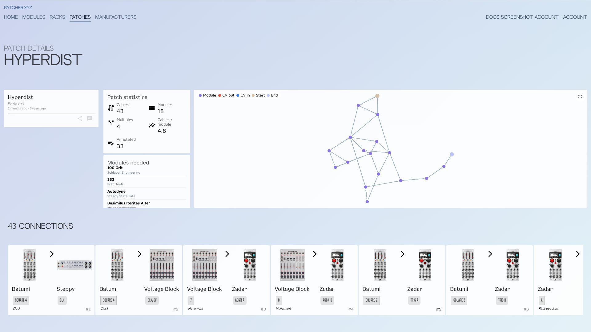

# Patches

Patches are the memory layer of Patcher.

Use them when you need more than a loose note or a photo on your phone. A good patch entry lets you reopen a session later and still understand what mattered.

_The patch editor — capture modules, routing, and notes for reliable recall later._

## What a patch can hold

A patch can bring together:

- the modules involved
- cable routing between those modules
- notes and descriptive text
- names that make recall easier later
- sharing choices for public visibility

## Create a patch

1. Go to **User Area**.
2. Open the **Patches** section.
3. Click **Create patch**.
4. Name it clearly.
5. Add the modules you need.
6. Start documenting routing and notes.

## Why collection-first matters here

Patches work best when your [Collection](collection.md) is already accurate.

An accurate collection gives you a reliable source list for module assignment and keeps your patch notes grounded in the hardware you actually use.

## Add modules and connections

Once the patch contains the right modules, add the routing step by step.

Patches distinguish repeated copies of a module as numbered instances, so each connection targets the intended copy.

Use that deliberately. When a patch includes two or three copies of the same module doing different jobs, the numbered instances stay disambiguated across every connection you draw.

If a module is missing useful I/O data, improving the module record first pays off across every future patch — see [Contributing module data](contributing-module-data.md).

## Views for reading the patch

Beyond the default editor, patches expose two review-oriented views:

- **Patch graph** — a graph-style view of the patch that reads modules and connections as nodes and edges. Useful for spotting routing loops, missing terminations, or unbalanced sections.
- **Fullscreen** mode — maximizes the current view for close reading during a session.

You can also produce a **PNG export** of the patch when you need a static image for notes, a message thread, or a printout.

## Share URLs

Public patches are addressable through **opaque `public_id`** URLs. These are the current canonical share links — a `public_id` URL is safe to paste anywhere without leaking anything about the patch's numeric internals.

The older numeric link scheme for patches is retired. If someone hands you a legacy numeric URL, see [FAQ](../the-project/readme.md) for what happens when you open it.

## Edit while you work

Patches are built for fast iteration during an active session, not only after it ends. Edits persist as you make them, so you can adjust routing and notes without babysitting a save action.

## Naming and notes

The more patches you save, the more naming matters.

Good patch names and notes should answer:

- what the patch does
- what makes it different
- what you would need to remember under pressure

## Public and private use

Not every patch needs to be shared.

New racks and patches start Public. You can switch them to **Private** before creation or at any time later.

Private racks and patches are **unlisted**: they are hidden from public browse and public-profile listings, but anyone with the token URL can still open them anonymously. Private is **not a security boundary** — use it to declutter listings, not to protect sensitive material.

For public discovery, both the patch itself and your profile need to be public. See [Public Profiles](public-profiles.md) and [Account and Privacy](account-and-privacy.md).

## Best practices

- save patches while the session is still fresh
- keep names specific
- note unusual routing or settings
- treat repeated instances as distinct voices, not interchangeable placeholders
- share only the patches you actually want attached to your public profile

## Related pages

- [Collection](collection.md)
- [User Area](user-area.md)
- [Racks](racks.md)
- [Public Profiles](public-profiles.md)
- [Modular glossary](../learn/modular-glossary.md)
