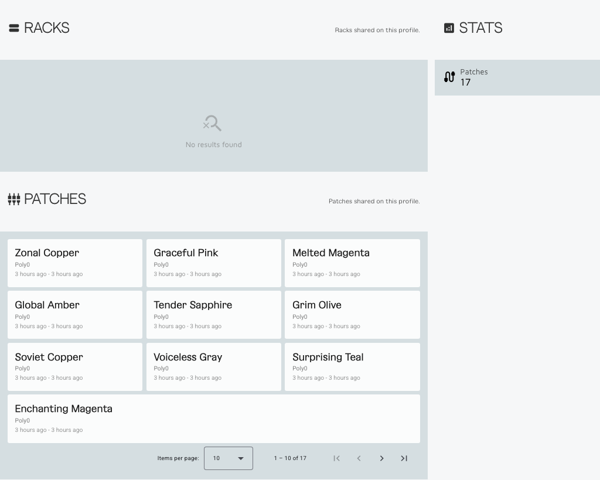

# Public Profiles

Public profiles are the shareable face of your workspace.

They give you a clean page tied to your username without making everything you do in Patcher public.

## What a public profile can show

When enabled, a profile can show:

- your username
- your website link, if one is present on the profile
- public racks
- public patches
- profile stats
- contributor stats

## What stays under your control

Public visibility is a choice, not a requirement.

You can keep your profile private and still use the rest of Patcher normally.

Public browsing only shows racks and patches when both the item itself and the profile are public.

## Typical uses

- sharing a curated set of racks
- linking people to selected patches
- giving collaborators or followers one stable page
- building a public presence without exposing your whole workspace

## Useful actions

From your own profile flow, you can usually:

- view your public profile
- copy the public link
- switch the profile between public and private

## Best practices

- make the profile public only when the visible content is intentional
- keep names, descriptions, and links clean before sharing
- treat the profile as a curated public surface, not a dump of everything

## Related pages

- [User Area](user-area.md)
- [Account and Privacy](account-and-privacy.md)
- [FAQ](../the-project/readme.md)
