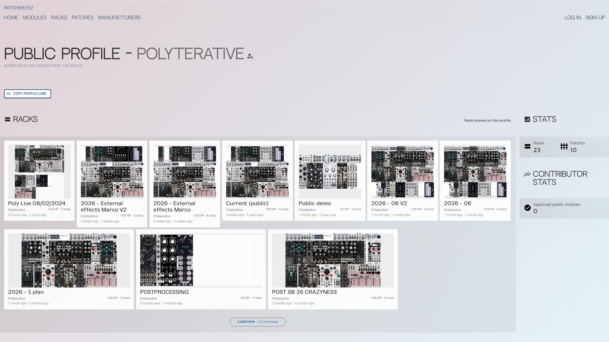

# Public Profiles

Public profiles are the shareable face of your workspace.

They give you a clean page tied to your username without making everything you do in Patcher public.

_A public profile — a curated surface showing the racks and patches you have chosen to publish._

## Where a profile lives

Every user has a profile route at `/u/:username`, so `patcher.xyz/u/your-username` resolves to that profile — when the profile is public.

## Username and display name

Two things matter, and they are not the same:

- The **username** is the stable identifier baked into your profile route (`/u/:username`). It is what makes the profile addressable.
- The **display name** is the visible name Patcher shows on the profile page and around the app. You can update the display name from your account controls without breaking any public link that already points at your username.

Change the display name freely for how you want to be shown; keep the username stable for what you want to be linked to.

## What a public profile can show

When enabled, a profile can show:

- your username and display name
- your website link, if one is present on the profile
- public racks
- public patches
- profile stats
- contributor stats

## Share URLs for racks and patches

Public racks and patches are addressable through **opaque `public_id`** URLs — the current canonical share links, independent of the profile route. Sharing a `public_id` URL for a rack or patch works even when you are not sharing your full profile.

## Private items and the token URL

Profile visibility does not change an item's own visibility. Making a profile Private does not make its existing Public racks or patches Private — item visibility stays where you set it on each item.

Private racks and patches are unlisted: they do not show up in browse or on public-profile listings. Anyone with the token URL can still open them anonymously, though. Private is not a security boundary; use it to declutter listings, not to protect sensitive material. See [Account and Privacy](account-and-privacy.md) for the full visibility model.

## What stays under your control

Public visibility is a choice, not a requirement.

You can keep your profile private and still use the rest of Patcher normally.

Public browsing only shows racks and patches when both the item itself and the profile are public.

## Typical uses

- sharing a curated set of racks
- linking people to selected patches
- giving collaborators or followers one stable page
- building a public presence without exposing your whole workspace

## Useful actions

From your own profile flow, you can usually:

- view your public profile
- copy the public link
- switch the profile between public and private
- update the display name

## Best practices

- make the profile public only when the visible content is intentional
- keep names, descriptions, and links clean before sharing
- treat the profile as a curated public surface, not a dump of everything
- keep your username stable; adjust the display name when you want a visual change

## Related pages

- [User Area](user-area.md)
- [Account and Privacy](account-and-privacy.md)
- [Racks](racks.md)
- [Patches](patches.md)
- [FAQ](../the-project/readme.md)
