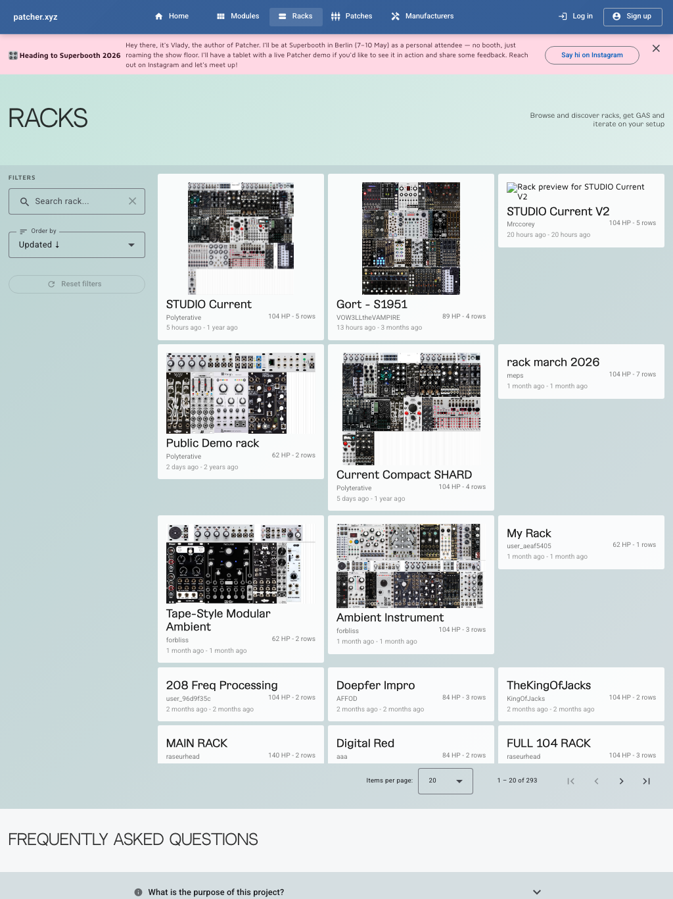

# Racks

Racks are where planning becomes physical.

Use them to model a real case, test an idea before rearranging hardware, or compare multiple layouts without losing the
earlier version.

## What racks are for

- planning a future case
- documenting a current case
- testing fit before buying
- comparing alternate layouts
- sharing a clean public version of your setup

## Create a rack

1. Go to **User Area**.
2. Open the **Racks** section.
3. Click **Create rack**.
4. Open the new rack and start building.

## Add modules to a rack

The usual flow is:

1. Add your real modules to your collection first.
2. Open a rack.
3. Add modules from the collection-driven workflow.
4. Arrange them until the layout feels right.

This keeps the rack tied to the hardware you actually own instead of drifting into a disconnected mockup.

## Edit and reorganize

Racks are meant to be adjusted repeatedly.

Common actions include:

- moving modules visually
- duplicating a module
- deleting a module
- replacing a module with a blank panel
- clearing part of a row when you want to rethink a section

## Blank panels and spacing

If you need a gap, use a blank panel instead of forcing the layout to stay fully packed.

That is useful for:

- ergonomic spacing
- cable clearance
- representing intentional empty HP
- planning future additions

## Analysis and fit

Rack detail is more than a visual builder.

Use it to review practical constraints such as:

- module count
- fit and arrangement
- power analysis
- function and balance-oriented analysis

These views help you spot problems before they turn into physical changes.

Power analysis helps you review draw across the main rails.

Function analysis helps you read the rack by role instead of only by placement.

Balance views depend on module data coverage, so they are most useful when the modules in the rack have enough category
data to support meaningful analysis.

## Panel variants

Some modules support more than one panel image or style.

When available, you can switch variants inside a rack so the layout better matches the real hardware in front of you.
That is especially useful when the same module exists in different finishes or panel revisions.

## Saving and sharing

Racks are built for iteration. Open them, edit them, and keep refining.

New racks currently start public, so check the sharing toggle if you want a rack private while you iterate.

For public discovery, the rack itself needs to be public and your profile also needs to be public.

## Best practices

- start with the modules you own
- leave some room when that helps usability
- check rack analysis before calling a layout finished
- keep separate racks for alternate versions instead of overwriting one plan

## Related pages

- [Collection](collection.md)
- [User Area](user-area.md)
- [Public Profiles](public-profiles.md)
