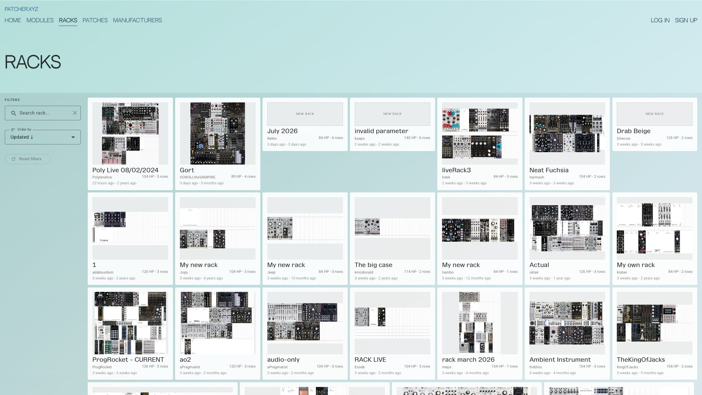

# Racks

Racks are where planning becomes physical.

Use them to model a real case, test an idea before rearranging hardware, or compare multiple layouts without losing the earlier version.

_The rack editor — build, rearrange, and analyze cases against your own collection._

## What racks are for

- planning a future case
- documenting a current case
- testing fit before buying
- comparing alternate layouts
- sharing a clean public version of your setup

## Create a rack

1. Go to **User Area**.
2. Open the **Racks** section.
3. Click **Create rack**.
4. Open the new rack and start building.

## Add modules to a rack

The usual flow is:

1. Add your real modules to your [Collection](collection.md) first.
2. Open a rack.
3. Add modules from the collection-driven workflow.
4. Arrange them until the layout feels right.

This keeps the rack tied to the hardware you actually own instead of drifting into a disconnected mockup.

## Edit and reorganize

Racks are meant to be adjusted repeatedly. Common actions:

- move modules visually
- duplicate a module
- delete a module
- replace a module with a blank panel
- clear part of a row when you want to rethink a section
- use **undo** to step back from an edit that did not land well

The editor shows a **stale preview** indicator when the rack preview is behind your most recent edits, so you always know whether what you are looking at reflects the current state.

## Blank panels and spacing

If you need a gap, use a blank panel instead of forcing the layout to stay fully packed.

That is useful for:

- ergonomic spacing
- cable clearance
- representing intentional empty HP
- planning future additions

## Analysis modes

Power, function, layout, and signal analysis modes; layout mode adds Same HP/Combos suggestions plus Remix and Shuffle, subject to valid row formats and available module metadata.

Each mode reads the rack from a different angle:

- **Power** — draw across the main rails, so you can spot overloads before wiring anything.
- **Function** — modules grouped by role instead of only by placement, giving you a per-category readout of what the rack can do.
- **Layout** — arrangement help. **Same HP** suggests modules that fit the same slot; **Combos** proposes complementary neighbors; **Remix** rearranges the rack while keeping the same modules; **Shuffle** produces a fresh randomized layout. Layout suggestions need valid row formats and enough module metadata to be meaningful.
- **Signal** — signal-path context for the rack as a whole.

The rack also surfaces a **weakest-axis** hint that names which analytical axis (power, function coverage, category balance, and similar) is the weakest for the current layout — useful when you want a single line of feedback instead of a full sweep.

**Balance** context depends on module data coverage: it is most useful when the modules in the rack have enough category and function metadata to support meaningful comparison. Treat sparse output as a data-coverage issue, not a limitation of the analysis. See [Contributing module data](contributing-module-data.md) if you want to help close a gap.

## Panel variants

Some modules support more than one panel image or style.

When available, you can switch variants inside a rack so the layout better matches the real hardware in front of you. This is especially useful when the same module exists in different finishes or panel revisions.

## Saving and sharing

Racks are built for iteration. Open them, edit them, and keep refining. Patcher saves your work as you go.

New racks and patches start Public. You can switch them to **Private** before creation or at any time later.

For public discovery, both the rack itself and your profile need to be public. See [Public Profiles](public-profiles.md) for how profile and item visibility interact, and [Account and Privacy](account-and-privacy.md) for the full sharing model.

## Best practices

- start with the modules you own
- leave some room when that helps usability
- run each analysis mode before calling a layout finished
- keep separate racks for alternate versions instead of overwriting one plan

## Related pages

- [Collection](collection.md)
- [User Area](user-area.md)
- [Patches](patches.md)
- [Public Profiles](public-profiles.md)
- [Modular glossary](../learn/modular-glossary.md)
