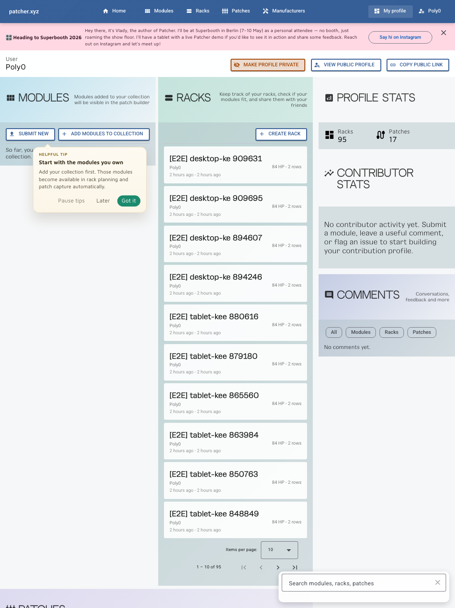

# User Area

User Area is your personal workspace inside Patcher.

It brings your saved modules, racks, patches, manuals, and profile controls together.

## What is in User Area

The layout is built around a few practical sections:

- **Modules** you have added to your collection
- **Racks** you are planning or maintaining
- **Patches** you are documenting
- **Profile stats** and **contributor stats**
- **Manuals** gathered from your saved modules
- **Comments** you have left around the platform
- a floating **global search** field for workspace-wide filtering

## Why it matters

This is where Patcher shifts from public catalogue to working tool.

As your workspace grows, User Area becomes the fastest way to:

- find your own data again
- see what is missing
- jump back into an unfinished idea
- open manuals without leaving the app

## Global search

The search field is not tied to a single section. It lets you scan modules, racks, and patches together, which matters
more as your workspace grows.

## Profile controls

User Area is also where you control whether your public profile is visible.

From here you can:

- make your profile public or private
- open your public profile
- copy your public profile link

## A good first setup

1. Add the modules you own.
2. Create one rack.
3. Create one patch.
4. Check that your profile settings match what you actually want public.

That is usually enough to make the workspace start paying off.

## Related pages

- [Collection](collection.md)
- [Racks](racks.md)
- [Patches](patches.md)
- [Public Profiles](public-profiles.md)
- [Account and Privacy](account-and-privacy.md)
