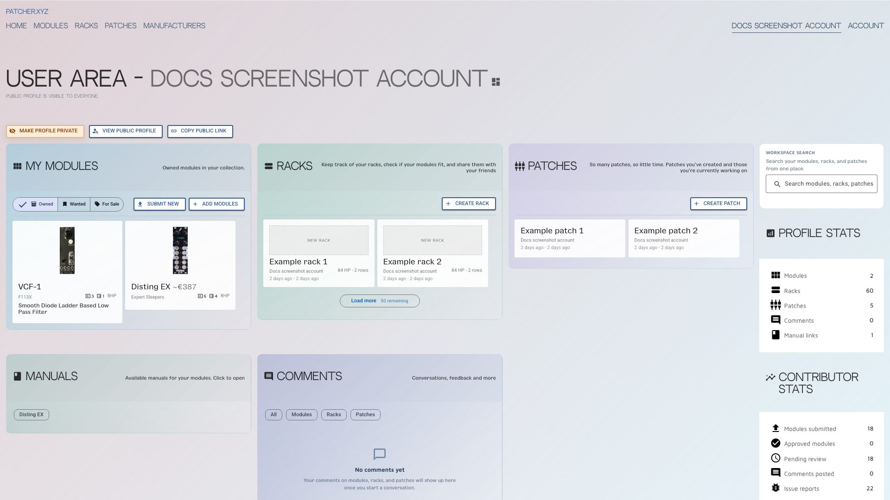

# User Area

User Area is your personal workspace inside Patcher.

It brings your saved modules, racks, patches, manuals, comments, stats, and profile controls together on one signed-in surface.

User Area is only available to signed-in users.

_User Area — your signed-in workspace, with search that spans every section at once._

## What is in User Area

The layout is built around a few practical sections:

- **Modules** you have added to your collection
- **Racks** you are planning or maintaining
- **Patches** you are documenting
- **Manuals** gathered from your saved modules
- **Comments** you have left around the platform
- **Stats** — profile stats and contributor stats side by side
- **Profile visibility** controls
- a floating **global search** field for workspace-wide filtering

The sections are paginated when they grow large, so you can move through bigger workspaces without one long scroll.

## Why it matters

This is where Patcher shifts from public catalogue to working tool.

As your workspace grows, User Area becomes the fastest way to:

- find your own data again
- see what is missing
- jump back into an unfinished idea
- open manuals without leaving the app

## Global search

The search field is not tied to a single section, but it is not one combined result list either.

Instead, the same query is applied across the main sections at the same time:

- **Modules** search name, manufacturer, description, and tags
- **Racks** search name and description
- **Patches** search name, description, and tags
- **Manuals** search module name, manufacturer, and description
- **Comments** search comment text and author usernames

The **Patches** section also has its own tag filter, which works alongside the main search field.

## Stats

The **Stats** section surfaces two views side by side:

- **Profile stats** — public-facing counts about your workspace (racks, patches, and other publishable material).
- **Contributor stats** — signals about the contributions you have made back to the shared catalogue.

Stats update as you save and share more work.

## Manuals

Every manual attached to a module in your [Collection](collection.md) surfaces automatically in the **Manuals** section, so a growing library gathers into one searchable list instead of scattered PDF links.

See [Manuals](manuals.md) for how manuals appear on module detail pages and here in your workspace.

## Comments

Any comment you have left around Patcher lives in the **Comments** section of your User Area. It is your history of participation — useful when you want to reread a conversation, follow up on a thread, or find where you have already answered a question.

Comment visibility follows the surface where each comment was left; nothing here is more or less public than it was on the page it lives on.

## Profile visibility

User Area is where you control whether your public profile is visible.

From here you can:

- make your profile public or private
- open your public profile
- copy your public profile link
- update your display name

For public discovery, both the profile and the individual rack or patch need to be public. See [Public Profiles](public-profiles.md) and [Account and Privacy](account-and-privacy.md).

## A good first setup

1. Add the modules you own.
2. Create one rack.
3. Create one patch.
4. Check that your profile settings match what you actually want public.

That is usually enough to make the workspace start paying off.

## Related pages

- [Collection](collection.md)
- [Racks](racks.md)
- [Patches](patches.md)
- [Manuals](manuals.md)
- [Public Profiles](public-profiles.md)
- [Account and Privacy](account-and-privacy.md)
